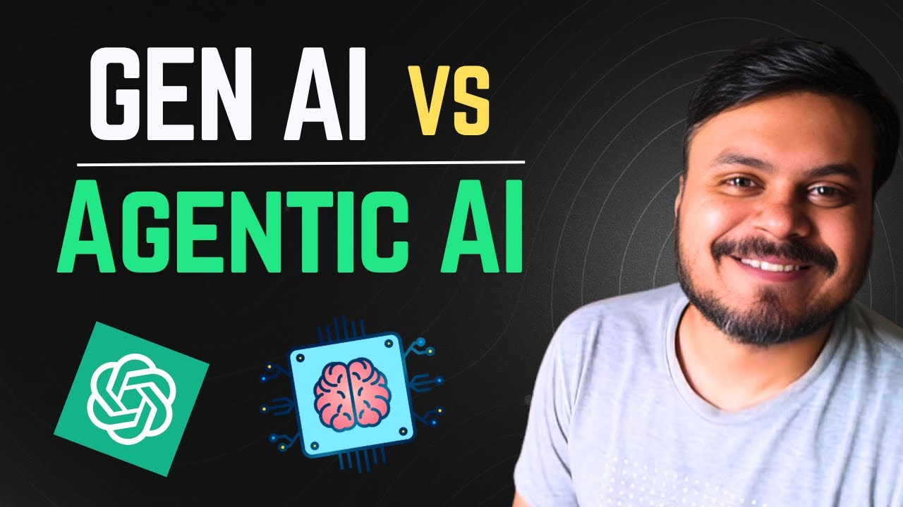
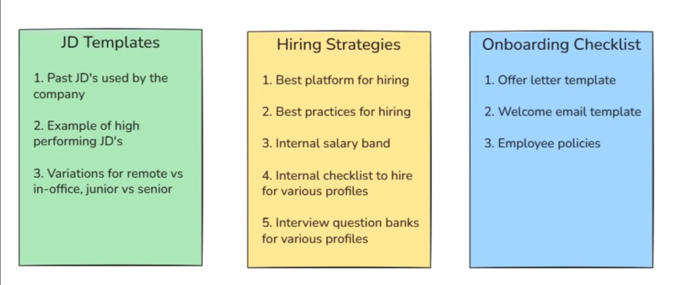

# 1.GenAi vs AgenticAi

---

# GenerativeAi

![CampusX - Generative AI vs Agentic AI Agentic AI using LangGraph Video #1 [xdA0pGDiUPE - 1536x864 - 6m57s].png](CampusX_-_Generative_AI_vs_Agentic_AI_Agentic_AI_using_LangGraph_Video_1_xdA0pGDiUPE_-_1536x864_-_6m57s.png)

![CampusX - Generative AI vs Agentic AI Agentic AI using LangGraph Video #1 [xdA0pGDiUPE - 1536x864 - 20m06s].png](CampusX_-_Generative_AI_vs_Agentic_AI_Agentic_AI_using_LangGraph_Video_1_xdA0pGDiUPE_-_1536x864_-_20m06s.png)

# GenAi vs TraditionalAi

![CampusX - Generative AI vs Agentic AI Agentic AI using LangGraph Video #1 [xdA0pGDiUPE - 1536x864 - 12m14s].png](CampusX_-_Generative_AI_vs_Agentic_AI_Agentic_AI_using_LangGraph_Video_1_xdA0pGDiUPE_-_1536x864_-_12m14s.png)

---

# Lets understand AgenticAi through a process

mainsteps that are envolved in sequence

![CampusX - Generative AI vs Agentic AI Agentic AI using LangGraph Video #1 [xdA0pGDiUPE - 1536x864 - 22m49s].png](CampusX_-_Generative_AI_vs_Agentic_AI_Agentic_AI_using_LangGraph_Video_1_xdA0pGDiUPE_-_1536x864_-_22m49s.png)

jd=job description

# Ways of achieving the hiring process from create job description to final drafting job offer

# ChatBot1:-using LLM Based Chatbot

step1:-

![CampusX - Generative AI vs Agentic AI Agentic AI using LangGraph Video #1 [xdA0pGDiUPE - 1536x864 - 24m16s].png](CampusX_-_Generative_AI_vs_Agentic_AI_Agentic_AI_using_LangGraph_Video_1_xdA0pGDiUPE_-_1536x864_-_24m16s.png)

step2:-

![CampusX - Generative AI vs Agentic AI Agentic AI using LangGraph Video #1 [xdA0pGDiUPE - 1536x864 - 24m49s].png](CampusX_-_Generative_AI_vs_Agentic_AI_Agentic_AI_using_LangGraph_Video_1_xdA0pGDiUPE_-_1536x864_-_24m49s.png)

step3:-

![CampusX - Generative AI vs Agentic AI Agentic AI using LangGraph Video #1 [xdA0pGDiUPE - 1536x864 - 25m48s].png](CampusX_-_Generative_AI_vs_Agentic_AI_Agentic_AI_using_LangGraph_Video_1_xdA0pGDiUPE_-_1536x864_-_25m48s.png)

step4:-

![CampusX - Generative AI vs Agentic AI Agentic AI using LangGraph Video #1 [xdA0pGDiUPE - 1536x864 - 26m22s].png](CampusX_-_Generative_AI_vs_Agentic_AI_Agentic_AI_using_LangGraph_Video_1_xdA0pGDiUPE_-_1536x864_-_26m22s.png)

step5:-

![CampusX - Generative AI vs Agentic AI Agentic AI using LangGraph Video #1 [xdA0pGDiUPE - 1536x864 - 27m14s].png](CampusX_-_Generative_AI_vs_Agentic_AI_Agentic_AI_using_LangGraph_Video_1_xdA0pGDiUPE_-_1536x864_-_27m14s.png)

step6:-

![CampusX - Generative AI vs Agentic AI Agentic AI using LangGraph Video #1 [xdA0pGDiUPE - 1536x864 - 27m49s].png](CampusX_-_Generative_AI_vs_Agentic_AI_Agentic_AI_using_LangGraph_Video_1_xdA0pGDiUPE_-_1536x864_-_27m49s.png)

problem with this chatbot

![CampusX - Generative AI vs Agentic AI Agentic AI using LangGraph Video #1 [xdA0pGDiUPE - 935x526 - 31m46s].png](CampusX_-_Generative_AI_vs_Agentic_AI_Agentic_AI_using_LangGraph_Video_1_xdA0pGDiUPE_-_935x526_-_31m46s.png)

reactive=manual interaction with chatbot

generic adice:- does not give answer according to the company data

can’t take action= this chatbot does not have power to do things by itslef

---

# ChatBot2:-RAG Based ChatBot

step1:-for this we have to provide data to the chatbot 

     example of data that we will feed this chatbot

step2:-

![CampusX - Generative AI vs Agentic AI Agentic AI using LangGraph Video #1 [xdA0pGDiUPE - 1536x864 - 35m52s].png](CampusX_-_Generative_AI_vs_Agentic_AI_Agentic_AI_using_LangGraph_Video_1_xdA0pGDiUPE_-_1536x864_-_35m52s.png)

step3:-

![CampusX - Generative AI vs Agentic AI Agentic AI using LangGraph Video #1 [xdA0pGDiUPE - 1536x864 - 36m18s].png](CampusX_-_Generative_AI_vs_Agentic_AI_Agentic_AI_using_LangGraph_Video_1_xdA0pGDiUPE_-_1536x864_-_36m18s.png)

step4:-

![CampusX - Generative AI vs Agentic AI Agentic AI using LangGraph Video #1 [xdA0pGDiUPE - 1536x864 - 36m57s].png](CampusX_-_Generative_AI_vs_Agentic_AI_Agentic_AI_using_LangGraph_Video_1_xdA0pGDiUPE_-_1536x864_-_36m57s.png)

step5:-

![CampusX - Generative AI vs Agentic AI Agentic AI using LangGraph Video #1 [xdA0pGDiUPE - 1536x864 - 37m31s].png](CampusX_-_Generative_AI_vs_Agentic_AI_Agentic_AI_using_LangGraph_Video_1_xdA0pGDiUPE_-_1536x864_-_37m31s.png)

step6:-

![CampusX - Generative AI vs Agentic AI Agentic AI using LangGraph Video #1 [xdA0pGDiUPE - 1536x864 - 38m04s].png](CampusX_-_Generative_AI_vs_Agentic_AI_Agentic_AI_using_LangGraph_Video_1_xdA0pGDiUPE_-_1536x864_-_38m04s.png)

step7:-

![CampusX - Generative AI vs Agentic AI Agentic AI using LangGraph Video 1 CampusX [xdA0pGDiUPE - 1536x864 - 38m52s].png](CampusX_-_Generative_AI_vs_Agentic_AI_Agentic_AI_using_LangGraph_Video_1_CampusX_xdA0pGDiUPE_-_1536x864_-_38m52s.png)

problems with RAG Chatbots

![CampusX - Generative AI vs Agentic AI Agentic AI using LangGraph Video 1 CampusX [xdA0pGDiUPE - 1536x864 - 40m09s].png](CampusX_-_Generative_AI_vs_Agentic_AI_Agentic_AI_using_LangGraph_Video_1_CampusX_xdA0pGDiUPE_-_1536x864_-_40m09s.png)

---

# ChatBot3:-Tool Augmented Chatbot(chatbot having the access of tools(functions,api)

step1:-this type of chatbot  can have tools like

     

1.linkedin api:-for posting jobs on Linkedin

2.resume parser tool:- for seperating the resume accroding to the domain

3.calender api:- for scheduling 

4.mail api:- for sending and recieving main

5.HRM Access Tool:- for implenting the chatbot end to end

step2:-

![CampusX - Generative AI vs Agentic AI Agentic AI using LangGraph Video 1 CampusX [xdA0pGDiUPE - 1536x864 - 43m04s].png](CampusX_-_Generative_AI_vs_Agentic_AI_Agentic_AI_using_LangGraph_Video_1_CampusX_xdA0pGDiUPE_-_1536x864_-_43m04s.png)

step3:-

![CampusX - Generative AI vs Agentic AI Agentic AI using LangGraph Video 1 CampusX [xdA0pGDiUPE - 1536x864 - 43m41s].png](CampusX_-_Generative_AI_vs_Agentic_AI_Agentic_AI_using_LangGraph_Video_1_CampusX_xdA0pGDiUPE_-_1536x864_-_43m41s.png)

step4:- lets say compnay do not as many as reponse as they want then they would modify the job description to get more response

![CampusX - Generative AI vs Agentic AI Agentic AI using LangGraph Video 1 CampusX [xdA0pGDiUPE - 1536x864 - 45m08s].png](CampusX_-_Generative_AI_vs_Agentic_AI_Agentic_AI_using_LangGraph_Video_1_CampusX_xdA0pGDiUPE_-_1536x864_-_45m08s.png)

step4:-

![CampusX - Generative AI vs Agentic AI Agentic AI using LangGraph Video 1 CampusX [xdA0pGDiUPE - 1536x864 - 46m03s].png](CampusX_-_Generative_AI_vs_Agentic_AI_Agentic_AI_using_LangGraph_Video_1_CampusX_xdA0pGDiUPE_-_1536x864_-_46m03s.png)

step5:-

![CampusX - Generative AI vs Agentic AI Agentic AI using LangGraph Video 1 CampusX [xdA0pGDiUPE - 1536x864 - 46m47s].png](CampusX_-_Generative_AI_vs_Agentic_AI_Agentic_AI_using_LangGraph_Video_1_CampusX_xdA0pGDiUPE_-_1536x864_-_46m47s.png)

step6:-

![CampusX - Generative AI vs Agentic AI Agentic AI using LangGraph Video 1 CampusX [xdA0pGDiUPE - 1536x864 - 47m03s].png](CampusX_-_Generative_AI_vs_Agentic_AI_Agentic_AI_using_LangGraph_Video_1_CampusX_xdA0pGDiUPE_-_1536x864_-_47m03s.png)

step7:-

![CampusX - Generative AI vs Agentic AI Agentic AI using LangGraph Video 1 CampusX [xdA0pGDiUPE - 1536x864 - 47m21s].png](CampusX_-_Generative_AI_vs_Agentic_AI_Agentic_AI_using_LangGraph_Video_1_CampusX_xdA0pGDiUPE_-_1536x864_-_47m21s.png)

step8:-

![CampusX - Generative AI vs Agentic AI Agentic AI using LangGraph Video 1 CampusX [xdA0pGDiUPE - 1536x864 - 48m24s].png](CampusX_-_Generative_AI_vs_Agentic_AI_Agentic_AI_using_LangGraph_Video_1_CampusX_xdA0pGDiUPE_-_1536x864_-_48m24s.png)

problem with Tool Augmented Chatbot

![CampusX - Generative AI vs Agentic AI Agentic AI using LangGraph Video 1 CampusX [xdA0pGDiUPE - 1536x864 - 50m24s].png](CampusX_-_Generative_AI_vs_Agentic_AI_Agentic_AI_using_LangGraph_Video_1_CampusX_xdA0pGDiUPE_-_1536x864_-_50m24s.png)

---

# ChatBot4:-Agentic Ai Chatbot

stpe1:- this kind of chatbot just take the end goal and follow all the intermediate steps by themself

for example:-

step2:-

![CampusX - Generative AI vs Agentic AI Agentic AI using LangGraph Video 1 CampusX [xdA0pGDiUPE - 1536x864 - 53m10s].png](CampusX_-_Generative_AI_vs_Agentic_AI_Agentic_AI_using_LangGraph_Video_1_CampusX_xdA0pGDiUPE_-_1536x864_-_53m10s.png)

step3:-

![CampusX - Generative AI vs Agentic AI Agentic AI using LangGraph Video 1 CampusX [xdA0pGDiUPE - 1536x864 - 53m50s].png](CampusX_-_Generative_AI_vs_Agentic_AI_Agentic_AI_using_LangGraph_Video_1_CampusX_xdA0pGDiUPE_-_1536x864_-_53m50s.png)

step4:-

![CampusX - Generative AI vs Agentic AI Agentic AI using LangGraph Video 1 CampusX [xdA0pGDiUPE - 1536x864 - 54m33s].png](CampusX_-_Generative_AI_vs_Agentic_AI_Agentic_AI_using_LangGraph_Video_1_CampusX_xdA0pGDiUPE_-_1536x864_-_54m33s.png)

step5:-

![CampusX - Generative AI vs Agentic AI Agentic AI using LangGraph Video 1 CampusX [xdA0pGDiUPE - 1536x864 - 55m13s].png](CampusX_-_Generative_AI_vs_Agentic_AI_Agentic_AI_using_LangGraph_Video_1_CampusX_xdA0pGDiUPE_-_1536x864_-_55m13s.png)

step6:-

![CampusX - Generative AI vs Agentic AI Agentic AI using LangGraph Video 1 CampusX [xdA0pGDiUPE - 1536x864 - 55m32s].png](CampusX_-_Generative_AI_vs_Agentic_AI_Agentic_AI_using_LangGraph_Video_1_CampusX_xdA0pGDiUPE_-_1536x864_-_55m32s.png)

step6:-

![CampusX - Generative AI vs Agentic AI Agentic AI using LangGraph Video 1 CampusX [xdA0pGDiUPE - 1536x864 - 55m56s].png](CampusX_-_Generative_AI_vs_Agentic_AI_Agentic_AI_using_LangGraph_Video_1_CampusX_xdA0pGDiUPE_-_1536x864_-_55m56s.png)

step7:-

![CampusX - Generative AI vs Agentic AI Agentic AI using LangGraph Video 1 CampusX [xdA0pGDiUPE - 1536x864 - 56m24s].png](CampusX_-_Generative_AI_vs_Agentic_AI_Agentic_AI_using_LangGraph_Video_1_CampusX_xdA0pGDiUPE_-_1536x864_-_56m24s.png)

step8:-

![CampusX - Generative AI vs Agentic AI Agentic AI using LangGraph Video 1 CampusX [xdA0pGDiUPE - 1536x864 - 57m19s].png](CampusX_-_Generative_AI_vs_Agentic_AI_Agentic_AI_using_LangGraph_Video_1_CampusX_xdA0pGDiUPE_-_1536x864_-_57m19s.png)

# All the problem that we are facing in LLM chatbot,RAG chatbot and Tool Augmented chatbot are solved now

![CampusX - Generative AI vs Agentic AI Agentic AI using LangGraph Video 1 CampusX [xdA0pGDiUPE - 1536x864 - 58m36s].png](CampusX_-_Generative_AI_vs_Agentic_AI_Agentic_AI_using_LangGraph_Video_1_CampusX_xdA0pGDiUPE_-_1536x864_-_58m36s.png)